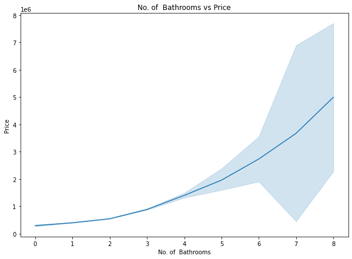

# Austin Animal Center Needs Analysis

**Author**: [Samuel Kabati](sam.kabati@student.moringaschool.com)

## Business Problem
Kempo is a real estate agency that helps homeowners buy or sell homes. The real estate agency would like to be able to advise homeowners on how some of their home features are likely to have an impact on the value of their home. The real estate Agency would also like to have a model that could predict house prices.

## Data
We have data collected on homes that were sold in King's County in 2015.

## Methods

This project uses exploratory analysis, to analyze the datasets so as to summarize their main characteristics using statistical methods and visualisations.

## Results
 -The houses with an overall condition of about 3 and 4 seem to have the highest sale price. This is a suprise as you would expect the ones with an overall condition of about 5 to have the highest sale price.The rating index is from (1-5)
 -The number of bathrooms have a linear relationship to the price. The number of bathrooms could therefore contribute to the overall price of the house.
 -Price increases with the number of bedrooms upto around where we have 12 bedrooms. The price also increases from 12 to 33 bedrooms but there is a decrease in the slope meaning the impact of the number of bedrooms to the price decreases as soon as we get to about 12.
 -The most expensive houses have about two floors. One suprising inference is that those with one floor are more expensive as compared to those with three floors.
 -Houses with a view rating higher than two have a positive linear relationship with the price.
 -The King's County Grade and the prices have a positive linear relationship.

### Recommendations

This analysis leads to the following recommendations for the real estate agency:

-The real estate agency should advise homeowners in the King's County area looking to sell houses to ensure that the house can achieve a high grade as houses with a good grade sell for more.

-The real estste agency should advise home owners looking to sell to strive to achieve for an overall condition of about 3 or 4. This is as most houses sold have an overall condition of about 3 and 4 and they tend to be higher priced.

-The real estate agency should advise those looking to sell their homes to achieve a view rating higher than two. Most houses sold have a view rating higher than two and they tend to go for higher prices.

-Most houses sold in the King's County area are averagely priced and the real estate agency should advise people looking to sell to have averagely priced homes.
